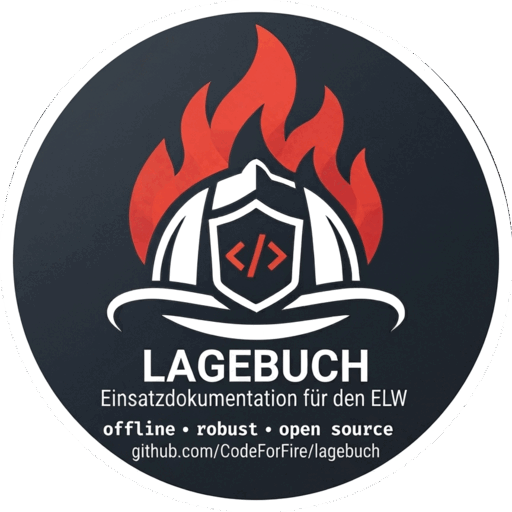
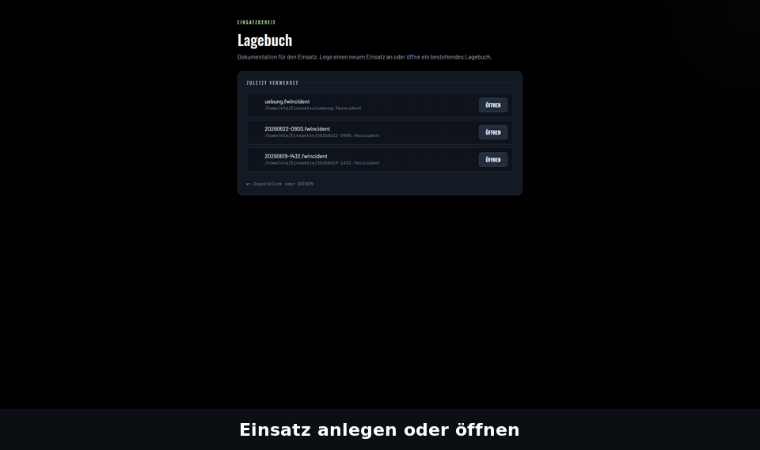
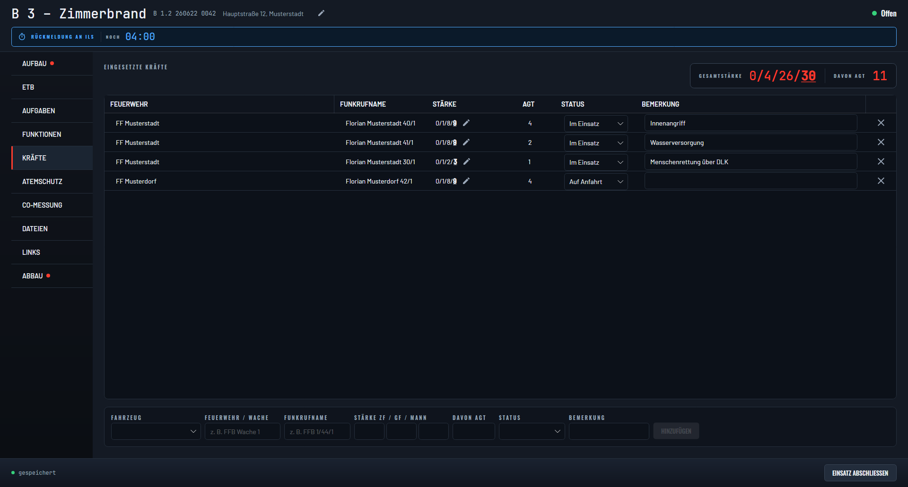

<p align="center">
  
</p>

<p align="center">
  <strong>Einsatzdokumentation für den ELW.</strong><br />
  Offline. Robust. Open Source.
</p>

<p align="center">
  <a href="https://github.com/CodeForFire/lagebuch/actions/workflows/ci.yml"></a>
  <a href="../../releases"></a>
  <a href="../../releases"></a>
  <a href="LICENSE"></a>
  <a href="https://scorecard.dev/viewer/?uri=github.com/CodeForFire/lagebuch"></a>
  <a href="https://www.bestpractices.dev/projects/14683"></a>
</p>

<p align="center">
  
</p>

Lagebuch ist das digitale Einsatztagebuch für den Einsatzleitwagen: eine
Desktop-Anwendung, die auch ohne Netz, ohne Cloud und ohne Abo funktioniert.
Ein Einsatz ist eine Datei auf dem ELW-Laptop – mit Einsatztagebuch, Kräften,
Atemschutzüberwachung, Aufgaben, CO-Messprotokoll und PDF-Bericht.

*English speakers: the developer documentation starts at [For developers](#for-developers).*

## Für wen ist Lagebuch?

- **ELW-Besatzung und Führungsassistenten**, die im Einsatz mitschreiben,
  Kräfte führen und die ILS auf dem Laufenden halten – mit der Tastatur, ohne
  Maus-Akrobatik.
- **Atemschutzüberwachung**, die verlässliche Zeiten, Druckabfragen und einen
  Rückzugsalarm braucht, den man auch im lauten ELW hört.
- **Kleine und mittlere Wehren**, die keine Lizenzgebühren, keine Server und
  keine IT-Abteilung haben – aber trotzdem sauber dokumentieren wollen.

## Warum Lagebuch?

- **Läuft offline – wirklich.** Kein Internet, kein Konto, kein Server. Jeder
  Einsatz ist eine einzelne `.fwincident`-Datei, die dir gehört und die du
  archivieren, kopieren oder weitergeben kannst.
- **Keine Daten verlassen den ELW.** Stammdaten, Namen und Handynummern
  liegen nur auf deinem Gerät. Die optionale Mehrgeräte-Verbindung läuft im
  LAN oder über Tailscale, TLS-gesichert mit PIN – ohne Cloud, ohne Telemetrie.
  Was genau wo gespeichert wird, steht in
  [Datenschutz und Sicherheit](docs/datenschutz-und-sicherheit.md) – die Seite
  für die Kreisbrandinspektion und den Datenschutzbeauftragten.
- **Open Source, MIT-Lizenz.** Kein Abo, keine Sitzplatzlizenzen, kein
  Vendor-Lock-in. Der Quellcode ist einsehbar, Änderungswünsche sind ein Issue
  entfernt.

## Was Lagebuch kann

| Modul | Was es tut |
|---|---|
| **Einsatzdaten** | Stichwort, bayerische Einsatznummer (`B 1.2 JJMMTT lfd.Nr.`) und Adresse – nachtragbar, sobald die ILS zurückruft |
| **ETB** | Einsatztagebuch mit Richtung (Eingang/Ausgang/intern), automatischen Systemeinträgen und nachträglicher Korrektur mit Historie |
| **Kräfte** | Fahrzeuge aus den Stammdaten, Stärke als ZF/GF/Mann, AGT-Zahl, Status und Bemerkung; Gesamtstärke immer im Blick |
| **Aufgaben** | Aufträge mit Wichtigkeit, Dringlichkeit, Zuständigem und Timer – mit Sprachansage, wenn sie fällig werden; direkt aus einem ETB-Eintrag anlegbar |
| **Funktionen** | EL, Abschnittsleiter und weitere Rollen mit von/bis, Übergabe und Handynummer |
| **Atemschutzüberwachung** | Trupps mit Einstiegsdruck, Einsatzzeit-Countdown, Druckabfrage-Intervall, Rückzugsdruck und Rückzugsalarm – mit Sprachansage und Sirene |
| **Rückmeldung an ILS** | Erinnerung nach konfigurierbarer Zeit, danach im Intervall, mit ERLEDIGT-Quittierung; überlebt Neustart und Absturz |
| **CO-Messprotokoll** | Haus, Stockwerk, Wohnung: Status (offen / durchsucht / betroffen), ppm-Wert mit Gefahrenfarbe, Bewohnername, Schlüssel vorhanden – wie die Türmarkierung vor Ort |
| **Checklisten** | Aufbau- und Abbau-Checklisten aus den eigenen Stammdaten, Pflichtpunkte markiert, Abschluss im ETB protokolliert |
| **Dateien & Links** | Fotos und PDFs an den Einsatz hängen (landen im Bericht); Schnellzugriff auf Wetter, Karten, Hydrantenplan |
| **PDF-Bericht** | Ein Klick, Abschnitte wählbar, Anhänge eingebettet – fertig für Akte und Kreisbrandinspektion |
| **Mehrere Geräte** | Einsatz auf dem ELW-Laptop hosten, mit Tablet oder zweitem Laptop im LAN/Tailscale mitschreiben; Android-App als Begleitgerät |

## Lagebuch im Vergleich

Alle Angaben laut Herstellerseiten, Stand September 2026. Fehler oder
Änderungen? Bitte [ein Issue öffnen](../../issues/new/choose).

| | Lagebuch | Papier | [Fireboard](https://fireboard.net/) | [MissionBuddies](https://www.missionbuddies.de/) | [fireplan.elw](https://www.fireplan.de/elw) |
|---|---|---|---|---|---|
| Ohne Internet voll nutzbar | ja | ja | Desktop-Suite ja; Stammdaten und Ticker über das Cloud-Portal ([Quelle](https://fireboard.net/)) | ja, Abgleich sobald wieder online ([Quelle](https://www.missionbuddies.de/atemschutzueberwachung/)) | ja, als Browser-App ([Quelle](https://www.fireplan.de/elw)) |
| Daten bleiben im ELW, kein Cloud-Konto | ja, eine Datei pro Einsatz | ja | nein, „cloudbasierte Lösung“ mit Portal-Benutzerkonto ([Quelle](https://fireboard.net/)) | nein, Cloud mit Servern in Deutschland ([Quelle](https://www.missionbuddies.de/faq/)) | k. A. |
| Mehrere Geräte im Einsatz | ja, LAN/Tailscale, TLS-gepinnt, ohne Server | nein | ja, über Portal ([Quelle](https://fireboard.net/produkte/module/grundsystem/)) | ja; gratis auf 2 Geräten, Premium unbegrenzt ([Quelle](https://www.missionbuddies.de/atemschutzueberwachung/)) | ja, live nur mit Internet ([Quelle](https://www.fireplan.de/elw)) |
| Atemschutzüberwachung | ja, mit Sprachansage und Rückzugsalarm | Überwachungstafel | ja, laut Produktseite ([Quelle](https://fireboard.net/)) | ja, Gratis-Stufe ([Quelle](https://www.missionbuddies.de/atemschutzueberwachung/)) | k. A. |
| CO-Messprotokoll | ja | Zettel | k. A. | k. A. | k. A. |
| PDF-Einsatzbericht | ja, Abschnitte wählbar | nein | ja ([Quelle](https://fireboard.net/produkte/module/grundsystem/)) | ja, modulweise Export ([Quelle](https://www.missionbuddies.de/faq/)) | k. A. |
| Kosten | 0 €, MIT-Lizenz | Papier | Grundsystem kostenfrei; Module wie Einsatzführung einmalig 600 € zzgl. 90 €/Jahr Wartung ([Preisliste 02/2026](https://fireboard.net/wp-content/uploads/2026/02/Fireboard-Preisliste-gesamt-Feb2026.pdf)) | Gratis-Stufe, sonst Abo ([Quelle](https://www.missionbuddies.de/faq/)) | auf Anfrage |
| Quellcode einsehbar | ja | – | nein | nein | nein |
| Plattformen | Windows, Linux, macOS; Android als Begleit-App | – | Windows, Linux, macOS; Mobile App iOS/Android | Android, Windows, iOS | jeder Browser (PWA) |

## Probefahrt in 5 Minuten

Alle Beispieldaten sind frei erfunden.

1. **Installieren** – Paket für dein System aus den
   [Releases](../../releases) laden, siehe [Installation](#installation).
2. **Stammdaten importieren** –
   [`demo-stammdaten.json`](docs/samples/demo-stammdaten.json)
   herunterladen ([Direktlink](https://github.com/CodeForFire/lagebuch/raw/main/docs/samples/demo-stammdaten.json)),
   in Lagebuch **STAMMDATEN → IMPORTIEREN** wählen, Datei öffnen, **SPEICHERN**.
   Jetzt kennen die Dropdowns zwei Wachen, sieben Fahrzeuge, ein paar Namen,
   Checklisten und Links.
3. **Übungseinsatz öffnen** –
   [`uebung.fwincident`](docs/samples/uebung.fwincident) herunterladen
   ([Direktlink](https://github.com/CodeForFire/lagebuch/raw/main/docs/samples/uebung.fwincident)),
   in Lagebuch **ÖFFNEN** wählen. Der Einsatz „B 3 – Zimmerbrand“ hat schon
   ETB-Einträge, vier Fahrzeuge, zwei Atemschutztrupps, Aufgaben und ein
   CO-Messprotokoll. Über **WEITER BEARBEITEN** kannst du selbst eingreifen.
4. **Ausprobieren** – einen ETB-Eintrag schreiben, im Tab **ATEMSCHUTZ** einen
   Trupp bereitstellen und starten, eine Aufgabe mit Timer anlegen, in der
   **CO-MESSUNG** eine Wohnung markieren.
5. **PDF EXPORTIEREN** – der fertige Einsatzbericht liegt nach ein paar
   Sekunden auf der Platte.

Wenn du danach mit deinen eigenen Daten weitermachen willst: Stammdaten
exportieren, `masterdata.db` löschen (Pfad siehe
[docs/master-data.md](docs/master-data.md)), eigene Datei importieren.

## Installation

Ein Paket pro Plattform liegt bei jedem [Release](../../releases):

| Plattform | Datei |
|-----------|-------|
| Windows | `lagebuch-<version>-x64.msi` |
| Linux (Debian/Ubuntu) | `lagebuch_<version>_amd64.deb` |
| Android | `lagebuch-<version>.apk` |
| macOS (Apple Silicon) | `lagebuch-<version>-macos-arm64.dmg` |

Alle Pakete bringen die .NET-Laufzeit mit; es muss nichts weiter installiert
werden. Die Pakete sind **noch nicht signiert**, deshalb warnt das
Betriebssystem beim ersten Start einmal:

- **Windows** – `.msi` ausführen; erscheint SmartScreen, *Weitere
  Informationen → Trotzdem ausführen*.
- **macOS** – `.dmg` öffnen, Lagebuch nach *Programme* ziehen, dann einmalig
  **Rechtsklick → Öffnen** (oder `xattr -dr com.apple.quarantine /Applications/Lagebuch.app`).
  Das `.dmg` wird auf Anfrage gebaut und an das Release angehängt.
- **Linux** – `sudo apt install ./lagebuch_*.deb`. Bitte `apt`, nicht
  `dpkg -i`: das Paket deklariert seine Systemabhängigkeiten (ICU, fontconfig,
  X11-Bibliotheken), die nur `apt` auflöst. Falls doch `dpkg -i`:
  `sudo apt-get -f install` räumt auf.
- **Android** – ab Android 6.0 (API 23); `.apk` öffnen und die Installation
  aus unbekannten Quellen für diese App einmal erlauben. Die Android-App ist
  ein Begleitgerät: sie verbindet sich mit einem Einsatz, der auf einem Laptop
  gehostet wird.

### Downloads prüfen

Jedem Release liegt `SHA256SUMS.txt` bei, und jede Installationsdatei trägt
einen Sigstore-Herkunftsnachweis aus dem Workflow-Lauf, der sie gebaut hat:

```bash
sha256sum -c SHA256SUMS.txt        # Linux, im Download-Ordner
shasum -a 256 -c SHA256SUMS.txt    # macOS
certutil -hashfile <Datei> SHA256  # Windows, mit SHA256SUMS.txt vergleichen
gh attestation verify <Datei> --repo CodeForFire/lagebuch
```

So lässt sich nachweisen, dass die Datei unverändert aus diesem Repository
stammt – auch solange die Pakete noch nicht signiert sind.

## Status

Lagebuch ist in aktiver Entwicklung und noch vor Version 1.0; zwischen
Versionen kann sich das Dateiformat ändern. Das Format ist versioniert: eine
Datei aus einer neueren Version wird mit klarer Meldung abgelehnt statt
beschädigt, ältere Dateien werden beim Öffnen migriert. Alle Änderungen stehen
im [CHANGELOG](CHANGELOG.md).

Woran wir als Nächstes arbeiten und was Version 1.0 bedeutet, stehen in der
[Roadmap](ROADMAP.md) – kurz gesagt: ab 1.0 bleibt eine Einsatzdatei dauerhaft
lesbar.

## Screenshots

Alle Screenshots zeigen fiktive Daten.

| | | | |
|---|---|---|---|
|  |  |  |  |
|  |  |  |  |

## Mitmachen & Kontakt

Lagebuch wird von [CodeForFire](https://github.com/CodeForFire) entwickelt –
Feuerwehrleuten aus Bayern, die im Einsatz selbst damit arbeiten.

- **Fragen** zur Bedienung, zur Installation oder zum ELW-Laptop →
  [Fragen & Antworten](../../discussions/categories/fragen-antworten). Dafür
  braucht ihr kein Bug-Ticket zu schreiben.
- **Feedback aus der Praxis** ist das Wertvollste: was fehlt im ELW, was
  nervt, was macht Papier heute noch besser? → [Ideen](../../discussions/categories/ideen)
  oder direkt ein [Issue öffnen](../../issues/new/choose).
- **Testen** auf eurem ELW-Laptop oder bei der nächsten Übung – auch ohne
  Programmierkenntnisse. Erzählt davon unter
  [Aus der Praxis](../../discussions/categories/aus-der-praxis).
- **Entwickeln, übersetzen, dokumentieren** → [CONTRIBUTING.md](CONTRIBUTING.md).
  Einstiegsaufgaben mit Anleitung liegen unter
  [good first issue](../../issues?q=is%3Aissue+is%3Aopen+label%3A%22good+first+issue%22).
- **Datenschutz** – welche Daten wo liegen, was übertragen wird, was ihr selbst
  regeln müsst und wie ihr alles wieder löscht →
  [Datenschutz und Sicherheit](docs/datenschutz-und-sicherheit.md).
- **Sicherheitslücken** bitte nicht öffentlich melden → [SECURITY.md](SECURITY.md).

---

## For developers

Lagebuch is an offline-first incident documentation app for fire brigades:
.NET 10 + Avalonia (desktop and Android), SQLite storage (one `.fwincident`
file per incident), SignalR sync with TLS trust-on-first-use, and
[QuestPDF](https://www.questpdf.com/) reports. The code and its documentation
are in English; the UI is German. Conventions, commit rules and the PII policy
are in [CONTRIBUTING.md](CONTRIBUTING.md).

### Build & Test

The SDK version is pinned in `global.json`. Building the Android head
additionally needs the .NET Android workload and a JDK ≤ 21 (newer JDKs are
rejected with `XA0030`; use the Docker build in [`docker/`](docker/)):

```bash
dotnet workload install android   # once per machine, Android head only
dotnet build                      # or: make build (desktop only, skips Android)
dotnet test                       # or: make test
```

### Run

```bash
dotnet run --project src/LageBuch.App/LageBuch.App.csproj   # or: make run
```

### Common tasks

A `Makefile` wraps the commands above plus the Android, packaging and
documentation ones. Run `make` for the full list:

```bash
make build            # everything except the Android head
make test             # PROJECT=... and/or FILTER=... to narrow
make run              # the desktop app
make apk              # build an installable APK in Docker
make run-android      # boot the emulator, install and launch
make package-linux    # build a local .deb
make samples          # regenerate docs/samples/uebung.fwincident
make screenshots      # regenerate docs/screenshots/*.png (headless Skia harness)
make demo-gif         # rebuild docs/demo/einsatz-flow.gif from the screenshots
```

### Master data

Dropdown contents (roles, vehicles, personnel, checklists, links) are never
compiled into the app: a fresh install starts empty and is populated by
importing a JSON file in the Stammdaten editor. The full description, storage
paths, and the PII rules are in [docs/master-data.md](docs/master-data.md);
the schema is documented by [`docs/master-data.example.json`](docs/master-data.example.json).

### Releasing

Pushing a version tag builds and publishes the packages; see
[docs/releasing.md](docs/releasing.md).

## License

[MIT](LICENSE)
