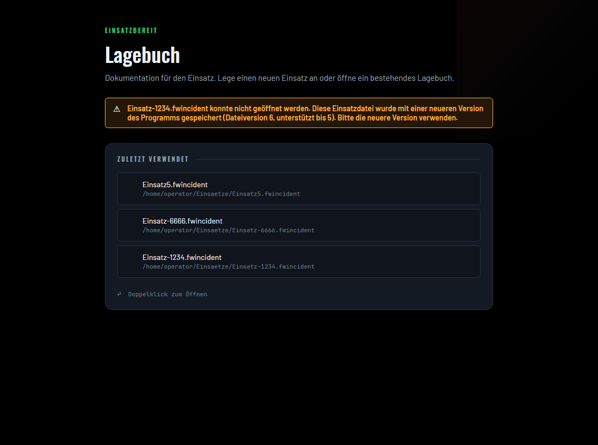
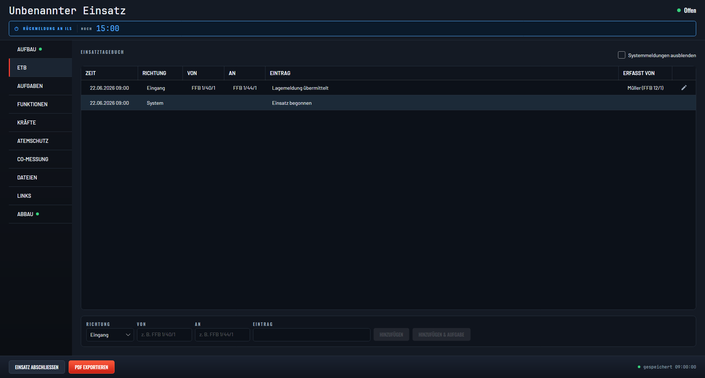
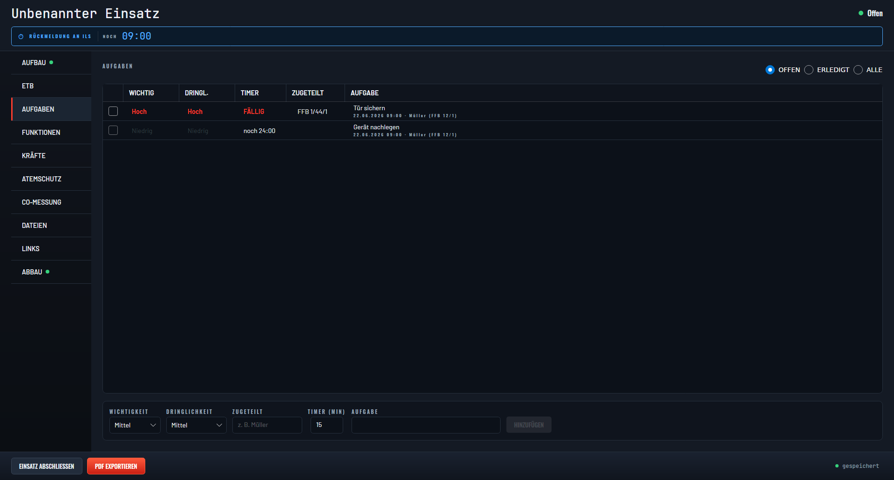
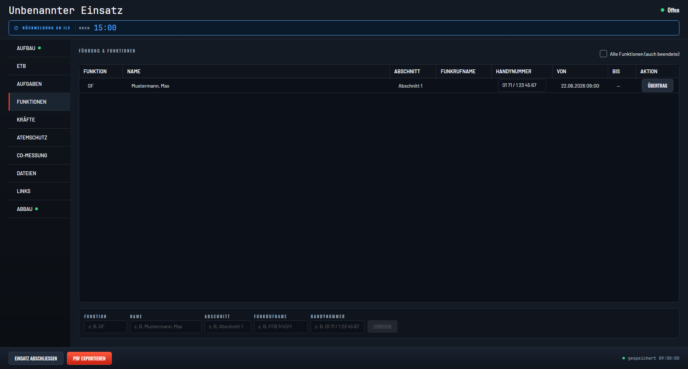
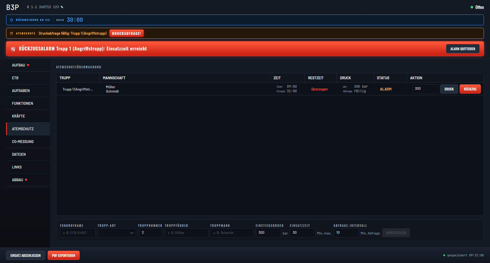
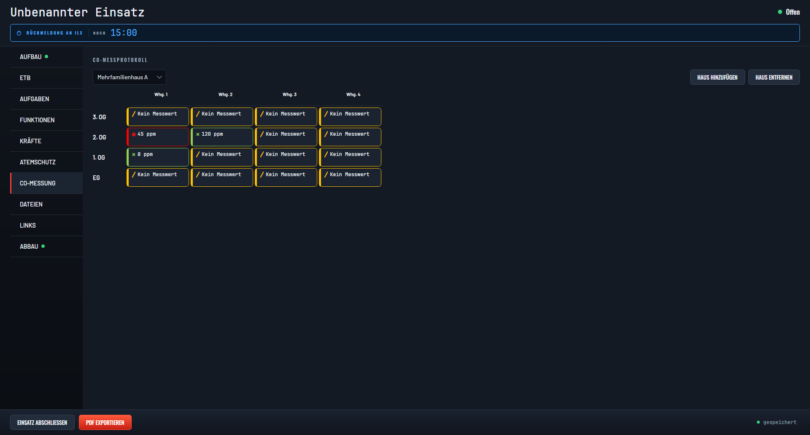
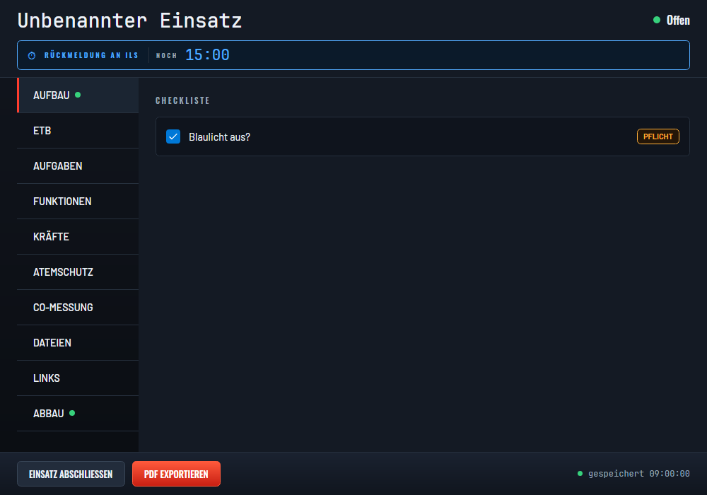
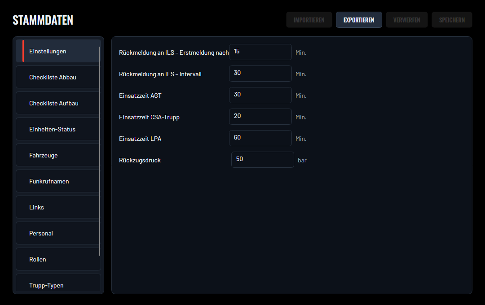

# Lagebuch

[](https://github.com/CodeForFire/lagebuch/actions/workflows/ci.yml)
[](../../releases)

Offline-first incident documentation (**Einsatzdokumentation**) for fire brigades.
Lagebuch ("log book") is one robust desktop application for the command vehicle
(ELW), cross-platform and fully offline, with optional multi-device sync and PDF
reports.

Built with .NET 8 + Avalonia (desktop & Android), SQLite storage, SignalR sync
and [QuestPDF](https://www.questpdf.com/) report generation.

| | | | |
|---|---|---|---|
|  |  |  |  |
|  |  |  |  |

*All screenshots show fictional data.*

## Features

**Incident workspace** — one window per Einsatz, keyboard-first:

- **Einsatzkopf** — Stichwort as the header hero, complete Bavarian-format
  Einsatznummer (`B 1.2 <JJMMTT> <lfd.Nr.>`), ILS number addable later
- **ETB** (Einsatztagebuch) — manual entries with incoming/outgoing direction,
  automatic lifecycle logging (open, close, reopen), later editing that keeps a
  full history
- **Kräfte** — units added from a Stammdaten Fahrzeug (live-filtered by typed
  Wache, already-assigned vehicles excluded), Stärke tracked as three numbers
  and committed as one atomic write plus one ETB entry via an explicit
  "Übernehmen" action, not per keystroke; Trupps are registered as crews, not
  individuals
- **Aufgaben** — task list with urgency/importance, assignee suggestions from
  call signs, Funktionen and personnel, a spoken due-alarm, and one-click
  creation straight from an ETB entry
- **Funktionen** — command roles (EL, Abschnitt, von/bis) with transfer support
  and editable mobile numbers
- **Atemschutzüberwachung** — SCBA teams with pressure-control interval,
  max-duration countdown, two-stage ILS Rückmeldung reminder with spoken cues
  and a Rückzugsalarm siren
- **CO-Messprotokoll** — building/floor/apartment search grid with per-dwelling
  status (not searched / searched / affected), CO ppm value, resident name and
  key-availability marker, mirroring the real-world door-marking convention
- **Checklisten** — Aufbau/Abbau checklists from your own master data, mandatory
  items highlighted, completion logged to the ETB
- **Dateien** — attach photos and PDFs to an incident; they are merged into the
  exported report
- **Links** — quick access to department bookmark links (weather, maps, ...)

**Beyond a single window:**

- **ILS status reminder** — incident-wide (not per Trupp): fires after a
  configurable "Erstmeldung nach" interval, then repeats on a configurable
  "Intervall" with a spoken cue and an ERLEDIGT option; persists across
  close/reopen/crash and is suppressed on joined/remote clients so the host
  doesn't double-log
- **PDF export** — one-click QuestPDF incident report
- **Multi-device sync** — host an incident on the ELW laptop and follow along
  from other devices over LAN or Tailscale (SignalR); joining requires a share
  PIN; Android is a join-only companion client
- **Offline & durable** — each incident is a single self-contained
  `.fwincident` SQLite file on disk; files written by a newer build are refused
  with a clear message instead of crashing

## Status

Early development, pre-1.0 — expect breaking changes between versions.
The incident schema is versioned; Lagebuch refuses to open files written by a
newer version rather than corrupting them.

## Install

Grab an installer from [Releases](../../releases). Pushing a version tag builds
and attaches one package per platform:

| Platform | File |
|----------|------|
| Windows | `lagebuch-<version>-x64.msi` |
| Linux (Debian/Ubuntu) | `lagebuch_<version>_amd64.deb` |
| Android | `lagebuch-<version>.apk` |
| macOS (Apple Silicon) | `lagebuch-<version>-macos-arm64.dmg` |

All builds are self-contained — no .NET runtime needs to be installed separately.
The packages are **not code-signed**, so the OS warns on first launch:

- **Windows** — run the `.msi`; if SmartScreen appears, *More info → Run anyway*.
- **macOS** — open the `.dmg`, drag Lagebuch to Applications, then **right-click
  the app → Open** once (or `xattr -dr com.apple.quarantine /Applications/Lagebuch.app`).
- **Linux** — `sudo dpkg -i lagebuch_*.deb` (or `sudo apt install ./lagebuch_*.deb`).
- **Android** — open the `.apk`; enable *install from unknown sources* for this
  app once when prompted.

The macOS `.dmg` is built on demand rather than on every tag: run the **Release**
workflow manually (*Actions → Release → Run workflow*) with the release version,
and the `.dmg` is attached to that release.

## Build & Test

Building the Android head requires the .NET Android workload (one-time, per machine):

```bash
dotnet workload install android
```

```bash
dotnet build
dotnet test
```

## Run

```bash
dotnet run --project src/LageBuch.App/LageBuch.App.csproj
```

## Releasing (maintainers)

Pushing a tag triggers the release workflow:

```bash
git tag v0.3.0 && git push origin v0.3.0
```

## Master data

Dropdown contents (roles, radio call signs, brigades, personnel, ...) are treated
as PII and are **never compiled into the application**. A fresh install starts
with **empty** master data; you populate it in the in-app **Stammdaten** editor
by importing a JSON file, and can write your own data back out again.

### Where it is stored

On first start an empty `masterdata.db` is created. It is the live database the
app reads and writes from then on, and where the Stammdaten editor saves:

| Platform | Path |
|---|---|
| Windows | `%AppData%\Lagebuch\masterdata.db` |
| Linux   | `~/.config/Lagebuch/masterdata.db` |
| macOS   | `~/.config/Lagebuch/masterdata.db` |

On macOS the app uses `~/.config`, **not** `~/Library/Application Support` —
that is simply where .NET's `ApplicationData` folder resolves on Unix. To start
over, delete `masterdata.db`; the app recreates it empty on the next launch.

### Import and export

Open **Stammdaten** and use the header buttons:

- **IMPORTIEREN** — offered only while the data is still empty (a first-run
  bootstrap, not a merge). Pick a JSON file; its contents load into the editor as
  unsaved changes for review, and reach `masterdata.db` only when you press
  **SPEICHERN** (or **VERWERFEN** to discard).
- **EXPORTIEREN** — writes the current master data (including unsaved edits) to a
  JSON file you can back up or hand to another install.

The file is one JSON object; every top-level key is optional, so a file may hold
the whole set, only the roster, or anything in between. See
[`docs/master-data.example.json`](docs/master-data.example.json) for the full
schema.

### PII

Any real master-data or personnel JSON — street lists, station and call-sign
names, and above all names and mobile numbers — is personal/identifying data and
must be kept **out of the repository**. `seed-source/` and `*.masterdata.json`
are gitignored for exactly this reason; only the anonymised
`docs/master-data.example.json` is tracked. An empty roster is a fully supported
state: the name field on the Funktionen tab offers the roster as suggestions but
always accepts free text, so off-roster and mutual-aid personnel can be entered
either way.

## License

[MIT](LICENSE)
